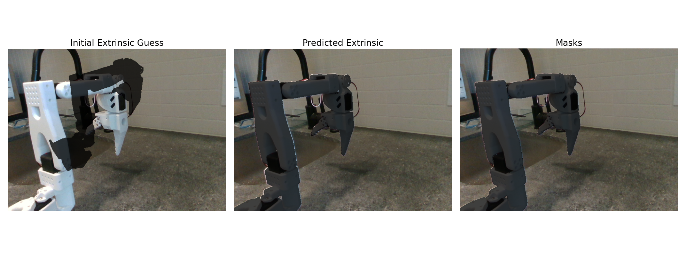

# Step-by-step Guide for Zero-Shot RGB Sim2Real Manipulation with LeRobot

Welcome to our tutorial on how to train a robot manipulation policy in simulation with Reinforcement Learning and deploy it zero-shot in the real world! This tutorial will take you through each step of a relatively simple approach for sim2real that does not rely on state estimation to perform sim2real, just RGB images. We will be using the SO100 robot for this and [ManiSkill](https://github.com/haosulab/ManiSkill) for fast simulation and rendering. You will also need a camera and access to some NVIDIA GPU compute (with at least 8GB of GPU memory) for fast training (Google Colab works but might be a bit slow). This tutorial is simple and can be improved in many ways from better RL tuning and better reward functions, we welcome you to hack around with this repo!

If you find this project useful, give this repo and [ManiSkill](https://github.com/haosulab/ManiSkill) a star! If you are using [SO100](https://github.com/TheRobotStudio/SO-ARM100/)/[LeRobot](https://github.com/huggingface/lerobot), make sure to also give them a star. If you use ManiSkill / this sim2real codebase in your research, please cite our [research paper](https://arxiv.org/abs/2410.00425):

```
@article{taomaniskill3,
  title={ManiSkill3: GPU Parallelized Robotics Simulation and Rendering for Generalizable Embodied AI},
  author={Stone Tao and Fanbo Xiang and Arth Shukla and Yuzhe Qin and Xander Hinrichsen and Xiaodi Yuan and Chen Bao and Xinsong Lin and Yulin Liu and Tse-kai Chan and Yuan Gao and Xuanlin Li and Tongzhou Mu and Nan Xiao and Arnav Gurha and Viswesh Nagaswamy Rajesh and Yong Woo Choi and Yen-Ru Chen and Zhiao Huang and Roberto Calandra and Rui Chen and Shan Luo and Hao Su},
  journal = {Robotics: Science and Systems},
  year={2025},
}
```

This tutorial was written by [Xander Hinrichsen](https://www.linkedin.com/in/xander-hinrichsen/) and [Stone Tao](https://stoneztao.com/)

Note that whenever you see some command line/script, in this codebase you can always add `--help` to get more information and options.

## 0: Configure your LeRobot setup

First you should update the `lerobot_sim2real/config/real_robot.py` file to match your own configuration setup. You might need to change how the camera is setup and the ID of the robot. This allows the rest of the code to be able to control the real robot. Moreover you should double check that you have calibrated your real robot's hardware correctly. With the current LeRobot hardware system you calibrate the robot motors by setting a 0 position (the first step of calibration) and moving the motors around. For accurate sim2real transfer, you must make sure you set the 0 position as accurately as possible and when moving the motors around you move them as far as physically possible.

## 1: Setup your simulation and real world environment

We provide a pre-built [simulation environment called SO100GraspCube-v1](https://github.com/haosulab/ManiSkill/tree/main/mani_skill/envs/tasks/digital_twins/so100_arm/grasp_cube.py) that only needs a few minor modifications for your own use. If you are interested in making your own environments to then tackle via sim2real reinforcement learning we recommend you finish this tutorial first, then learn how to [create custom simulated tasks in ManiSkill](https://maniskill.readthedocs.io/en/latest/user_guide/tutorials/custom_tasks/index.html), then follow the tutorial on how to [design them for sim2real support](https://maniskill.readthedocs.io/en/latest/user_guide/tutorials/sim2real/index.html)

In this section we will align the real world and simulation environments by configuring the robot installation location, camera positioning, and ensuring camera images match between sim and real. We'll modify the `env_config.json` file which configures the simulation environment for training. While this initial setup can be challenging, it only needs to be done once unless the camera position changes.

## 1.1: Setup the Robot and Camera in the Real World

First you want to find some surface to attach your robot onto with a reasonable amount of space in front of it for deployment. Then find a location to setup your camera so that it can see the robot as well as the space in front of it (which is where we will place objects for the robot to pick up). An example setup is shown below:

TODO new photo

## 1.2 Tune Robot Motor Offsets

While you already have calibrated the robot following the LeRobot calibration method (where you move motors around), we recommend adjusting it further to improve sim2real transfer. In `env_config.json` there is a field called `calibration_offset` which maps motor names to offsets in degrees. The default values are the ones that worked for our SO100, but you need to tune them such that when you run the command

```bash
python lerobot_sim2real/scripts/tune_calibration_offset.py --env-kwargs-json-path=env_config.json
```

the robot moves to the rest position shown below and maintains either 90 or 180 degree angles between robot links. If one of the motors is off, tune the offset for that motor until it looks good. Repeatedly check this by running the command above.


## 1.3: Get an image for greenscreening to bridge the sim2real visual gap 

Next, take the robot off the surface/table, connect the wires to the robot (don't worry, it won't be moving, this is just to control the camera), and then take a picture of the background using the following script. It will save to a file `greenscreen.png`. If you can't unmount the robot, you can take the picture anyway and use photo editing tools or AI to remove the robot and inpaint the background.

```bash
python lerobot_sim2real/scripts/capture_background_image.py --env-id="SO100GraspCube-v1" --env-kwargs-json-path=env_config.json --out=greenscreen.png
```

Note that we still use the simulation environment here but primarily to determine how to crop the background image. If the sim camera resolution is 128x128 (the default) we crop the greenscreen image down to 128x128. Once the greenscreen.png file is saved, modify "greenscreen_overlay_path" key in the env_config.json file to include the path to that file.

## 1.4 Determine the Real World Camera Extrinsics / Intrinsics

For sim2real transfer we want to train our robot from the same camera view as the real world camera. We will be using the [EasyHEC package](https://github.com/StoneT2000/simple-easyhec) to optimize and predict the real world camera extrinsic parameters (the translation and rotation of the camera relative to the robot base). This method is used as it is fairly automatic compared to past approaches that use checkerboards (hand-eye calibration) or the previous iteration of this guide (manually moving the camera). Currently only realsense cameras are supported, others can also be supported if you modify the code to figure out the camera intrinsics

To start the process, make sure you mount the robot back and then run

```bash
python lerobot_sim2real/scripts/easyhec_camera_calibration.py \
  --model-cfg ../sam2/configs/sam2.1/sam2.1_hiera_l.yaml --checkpoint ../sam2/checkpoints/sam2.1_hiera_large.pt \
  --env-kwargs-json-path=env_config.json
```

The script will move the robot to a few configurations and take pictures. Then it will open a GUI for you to annotate positive/negative points with to indicate which part of the image is the robot, which is not (make sure to only include 3D printed parts and motors, no wires or clamps etc.). After that process the optimization will hopefully converge and the calibration results as well as visualizations are saved to `results/so100/{robot_id}/base_camera`. The results below are an ideal case, if you have some error the training domain randomization can help overcome that at the cost of some performance.



Once the process is done and the results look good, modify the `env_config.json` `"base_camera_settings"` to point a path to the 128x128 intrinsics matrix and the extrinsics matrix .npy files saved by the calibration process. Note that the original intrinsics of the camera are not used, this is because intrinsics matrices need to be rescaled if you want to render different sized images with the same perspective (as we will do during training). 

> [!NOTE]
> If the process does not work well, usually it means either your initial extrinsic guess is too far off, or the segmentation masks are not good enough, or the additional motor tuning done in [step 1.2](#12-tune-robot-motor-offsets) was not good enough. The visualization above shows the quality of segmentation masks used for this example and the initial extrinsic guess, and the final predicted extrinsics. The accuracy is measured by how close the mask/shadow overlays the actual robot parts (excluding the wires).

## 1.5 Tune the simulation environment spawn region

Depending on your chosen camera location, it is possible that the spawn region of the object we will try and pick up is occluded. Fix this by modifying the `spawn_box_pos` field in the `env_config.json` file. After modifying run

```bash
python lerobot_sim2real/scripts/record_reset_distribution.py --env-id="SO100GraspCube-v1" --env-kwargs-json-path=env_config.json
```

Check that the spawned cube is always visible at the start. We recommend ensuring the has a clear view of the cube spawn region and of the robot + its gripper. Without a clear view there can be occlusion issues which will make it difficult to train a working model.


## 2: Visual Reinforcement Learning in Simulation

Now we get to train the robot we setup in the real world in simulation via RL. We provide a baseline training script for visual Proximal Policy Optimization (PPO), which accepts environment id and the env configuration json file so that we can train on an environment aligned with the real world. If you haven't already make sure to add the path to the greenscreen image in your env_config.json file.

For the SO100GraspCube-v1 environment we have the following already tuned script (uses about 8-10GB of GPU memory)

```bash
seed=3
python lerobot_sim2real/scripts/train_ppo_rgb.py --env-id="SO100GraspCube-v1" --env-kwargs-json-path=env_config.json \
  --ppo.seed=${seed} \
  --ppo.num_envs=1024 --ppo.num-steps=16 --ppo.update_epochs=8 --ppo.num_minibatches=32 \
  --ppo.total_timesteps=100_000_000 --ppo.gamma=0.9 \
  --ppo.num_eval_envs=16 --ppo.num-eval-steps=64 --ppo.no-partial-reset \
  --ppo.exp-name="ppo-SO100GraspCube-v1-rgb-${seed}" \
  --ppo.track --ppo.wandb_project_name "SO100-ManiSkill"
```

This will train an agent via RL/PPO and track its training progress on Weights and Biases and Tensorboard. Run `tensorboard --logdir runs/` to see the local tracking. Checkpoints are saved to `runs/ppo-SO100GraspCube-v1-rgb-${seed}/ckpt_x.pt` and evaluation videos in simulation are saved to `runs/ppo-SO100GraspCube-v1-rgb-${seed}/videos`. If you have more GPU memory available you can train faster by bumping the `--ppo.num_envs` argument up to 2048.

While training you can check out the eval videos which by default look like the following 4x4 grid showing 16 parallel environments:


Highlighted in red is just an enlarged image showing what the sim looks like. It is not what is fed to the policy during training or evaluation. Highlighted in blue is the actual 128x128 image given to the policy (you can ignore the colored segementation map), which shows the greenscreen in effect and possible other randomizations. If you don't want your eval videos to show the enlarged image and just show the actual image inputs, you can add `--ppo.render-mode="sensors"` and we will only save videos of the image inputs.

Moreover, for this environment the evaluation result curves may look approximately like this during training.


For the SO100GraspCube-v1 task you don't need 100_000_000 timesteps of training for successful deployment. We find that around 25 to 40 million are enough, which take about an hour of training on a 4090 GPU. Over training can sometimes lead to worse policies! Generally make sure first your policy reaches a high evaluation success rate in simulation before considering taking a checkpoint and deploying it.


## 3: Real World Deployment

Now you have a checkpoint you have trained and want to evaluate, place a cube onto the table in front of the robot. We recommend using cubes around 2.5cm in size since that is the average size the robot is trained to pick up in simulation. Furthermore we strongly recommend to be wary that you place the cube in a location that the robot was trained to pick from, which is dependent on your cube spawning randomization settings (if you aren't sure check the reset distribution video you generated in step 1).

Then you run your model on the real robot with the following. Note that each time the real environment needs to be reset you will be prompted in the terminal to do so and to press enter to start the next evaluation episode.

```bash
python lerobot_sim2real/scripts/eval_ppo_rgb.py --env_id="SO100GraspCube-v1" --env-kwargs-json-path=env_config.json \
    --checkpoint=path/to/ckpt.pt --no-continuous-eval --control-freq=15
```

For safety reasons we recommend you run the script above with --no-continuous-eval first, which forces the robot to wait for you to press enter into the command line before it takes each action. Sometimes RL can learn very strange behaviors and in the real world this can lead to dangerous movements or the robot breaking. If you are okay with more risk and/or have checked that the robot is probably going to take normal actions you can remove the argument to allow the RL agent to run freely. We further recommend for the SO100 hardware to stick to a control frequency of 15 which is a good balance of speed with accuracy/safety. Finally when running the script always be prepared to press `ctrl+c` on your keyboard, which will gracefully stop the script and return the robot to a rest position + disable torque. Make sure to be aware of if the robot is pressing an object/table too hard as it can break something.

Moreover you may want to check a few checkpoints that achieve high simulation evaluation success rate. Sometimes RL will learn something that does not generalize well to the real world, so some checkpoints might do better than others despite having the same performance in simulation. Grasping a cube is a fairly precise problem in many ways.

If all things go well, you can now get a rather fast autonomous cube picking policy like below!

https://github.com/user-attachments/assets/ca20d10e-d722-48fe-94af-f57e0b2b2fcd

## Frequently Asked Questions / Problems

As people report some common questions/problems, ways to address them will be populated here!

- **RL is not learning in 25-40 million timesteps**: There are many reasons why RL can fail. For one the default reward function provided is very simple, it is effectively about 5 lines of code. Moreover the default training script was tuned to keep GPU memory usage on the lower end to ensure older GPUs can run training as well. One way to stabilize RL training further is to increase training batch-size and number of parallel environments. You can try doubling the number of environments (use 2048) first and see how it goes. Another reason for RL to fail is if the camera positioning in simulation is hard to learn from. Some setups can make occlusions occur more often than not which makes the problem impossible without more advanced methods. Finally you can also try running with another seed for training.

- **Policy learns to reach and grasp the cube but tends to drop the cube later**: By default the eval script gives the robot 100 time steps (100 / control_freq seconds) of time to solve the task. At the end of that time the robot is commanded to go to a rest position which releases the gripper. If the robot is often releasing the cube way before the time and failing the task, one reason is the checkpoint you are using may not have trained long enough. It is possible that the checkpoint can get a high success rate in simulation but fail in the real world due to some differences in the calibration of the real robot and simulated robot. More training can often help make this a bit more robust. Another suggestion is to try another robot and/or try re-calibrating your robot, poor calibration/hardware issues can increase the sim2real gap and make performance worse.

- **Policy has low success rate, fails to grasp the cube**: In general even with poor calibration the policy should at least learn to reach the cube / push it around. Grasping the cube is harder and requires more accuracy. Beyond just calibration issues / following the suggestions above, you should also make sure you are placing the cube in a location that the robot has seen during training, namely the spawn area. If you aren't sure double check the reset distribution video you generated earlier to get a sense of how far cubes can be placed before it becomes out of distribution data.

- **Robot looks very misaligned compared to simulation and real world**: There are two common causes. One is improper calibration of the hardware via LeRobot's hardware calibration system. Please see the notes in step 0 of this tutorial for what we recommend to calibrate accurately. Another is improper alignment of the real world camera with where the simulation camera is located and pointing at. Real world camera calibration has historically been quite hard to do, and is something that just takes practice. The method outlined in this tutorial is not a typical method but is designed to be mostly hassle free and does not require more complex setting up like using aruco tags and checkerboards that traditonal camera hand-eye calibration uses. For the approach outlined here, we recommend spending some time to get a feel of how moving the camera in the real world along each axis (x,y,z translation and rotation) affects the alignment image overlay, and to slowly move the camera around until alignment is achieved.
